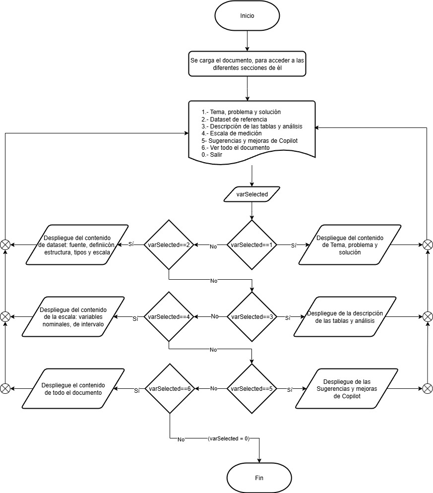
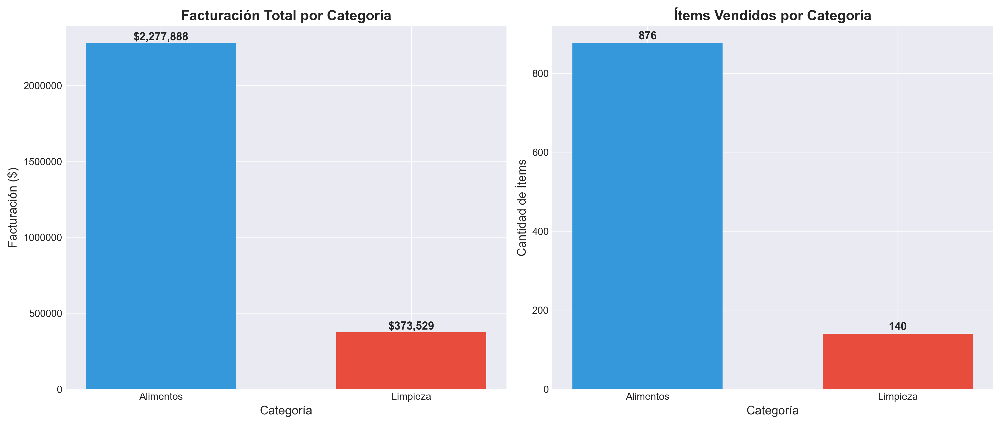
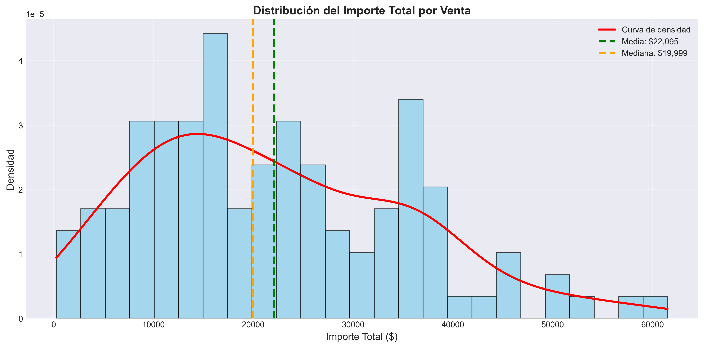
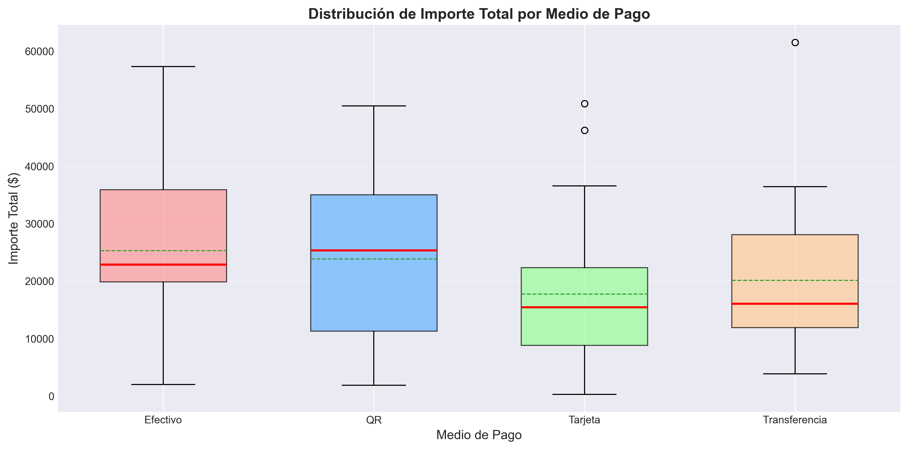
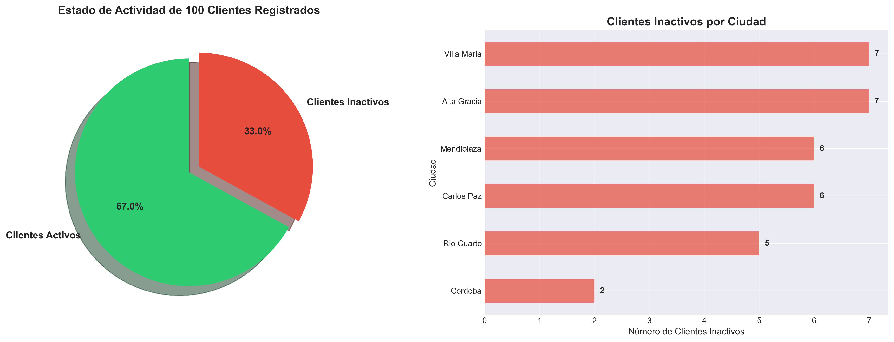
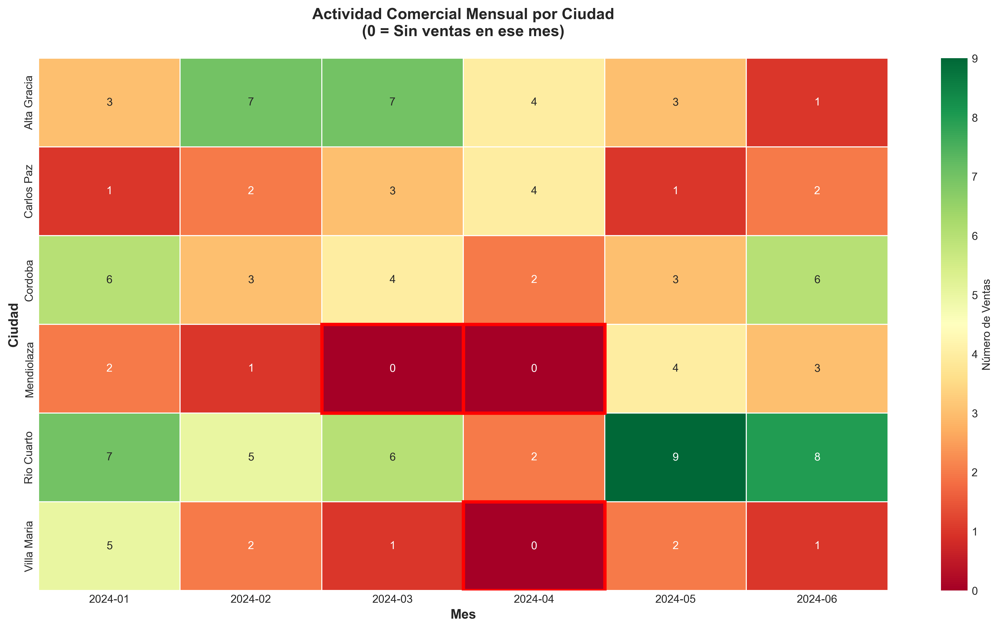
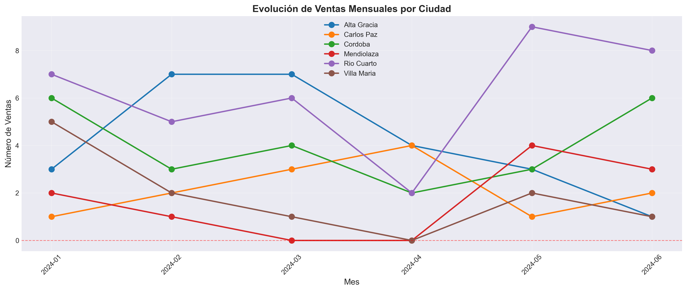

# 📊 Proyecto Aurelion

# 1° Demo: Asincrónica

---

## 1. Tema, problema y solución

### 🧩 Tema

**Análisis de ventas y comportamiento de clientes** en una tienda digital, utilizando datos de clientes, productos y transacciones registradas.

### ⚠️ Problema

La empresa ha detectado que algunos **clientes han dejado de comprar** o **no han concretado sus compras**, lo que representa una posible pérdida de ingresos.  
Además, existen **productos con bajas ventas** que podrían estar afectando el flujo de inventario y el crecimiento de la tienda.

### 💡 Solución

El proyecto busca desarrollar un sistema de análisis que permita identificar:

- Clientes inactivos o en riesgo de pérdida.
- Productos con baja rotación que podrían necesitar promoción o campañas de marketing.
- Los productos más vendidos y los clientes más activos para fidelizarlos.

De esta manera, la empresa podrá **tomar decisiones basadas en datos**, optimizando sus estrategias de ventas y marketing.

### 🎯 Objetivos del Proyecto

### Objetivo general:

Analizar la información de ventas, clientes y productos para identificar patrones de compra, productos con baja rotación y clientes inactivos, con el fin de proponer estrategias de mejora en ventas, promoción y retención de clientes.

### Objetivos específicos:

1. Detectar clientes que no han realizado compras.
2. Identificar productos con baja rotación.
3. Determinar los productos más vendidos.
4. Analizar los clientes más activos y su volumen de compra.
5. Generar un reporte de resultados que apoye la toma de decisiones.

---

## 2. Dataset de referencia: fuente, definición, estructura, tipos y escala de medición

### 📚 Fuente

Datos generados con fines educativos (archivos Excel provistos para el proyecto Aurelion).

### 🧾 Definición

Base que representa una **tienda virtual**, con un catálogo de productos, registro de clientes y operaciones de venta.

---

### 🛒 **Productos (productos.xlsx)** — ~100 filas

| Campo           | Tipo  | Escala  |
| --------------- | ----- | ------- |
| id_producto     | int   | Nominal |
| nombre_producto | str   | Nominal |
| categoria       | str   | Nominal |
| precio_unitario | float | Razón   |

**Análisis:**  
Esta tabla contiene el catálogo de productos disponibles. A partir de su información se pueden detectar los artículos más y menos vendidos, evaluar los precios unitarios y clasificar las categorías con mayor rotación.

---

### 👥 **Clientes (clientes.xlsx)** — ~100 filas

| Campo          | Tipo | Escala    |
| -------------- | ---- | --------- |
| id_cliente     | int  | Nominal   |
| nombre_cliente | str  | Nominal   |
| email          | str  | Nominal   |
| ciudad         | str  | Nominal   |
| fecha_alta     | date | Intervalo |

**Análisis:**  
Permite identificar el perfil del cliente y su antigüedad. Con esta tabla se pueden analizar **clientes activos vs. inactivos**, **ciudades con mayor número de compradores** y la evolución temporal de registros.

---

### 💳 **Ventas (ventas.xlsx)** — ~120 filas

| Campo          | Tipo | Escala    |
| -------------- | ---- | --------- |
| id_venta       | int  | Nominal   |
| fecha          | date | Intervalo |
| id_cliente     | int  | Nominal   |
| nombre_cliente | str  | Nominal   |
| email          | str  | Nominal   |
| medio_pago     | str  | Nominal   |

**Análisis:**  
Proporciona información sobre las transacciones realizadas. A partir de esta tabla se puede calcular la **frecuencia de compra** por cliente, los **medios de pago más utilizados** y la **distribución temporal de ventas**.

---

### 📦 **Detalle_Ventas (detalle_ventas.xlsx)** — ~300 filas

| Campo           | Tipo  | Escala  |
| --------------- | ----- | ------- |
| id_venta        | int   | Nominal |
| id_producto     | int   | Nominal |
| nombre_producto | str   | Nominal |
| cantidad        | int   | Razón   |
| precio_unitario | float | Razón   |
| importe         | float | Razón   |

**Análisis:**  
Relaciona las ventas con los productos específicos. Es la tabla clave para determinar **cuáles productos se venden más o menos**, los **ingresos generados por producto** y el **ticket promedio por venta**.

### Análisis de Ficheros de Datos: Aurelion

Este documento describe la estructura y propósito de los ficheros de datos en formato `.xlsx` encontrados en el proyecto.

### Descripción de los Ficheros

Basado en sus nombres, los ficheros representan una base de datos relacional simple:

1.  `clientes.xlsx`: Contiene la lista y los datos de todos los clientes. Cada fila representa un cliente único con su información (ID, nombre, etc.).

2.  `productos.xlsx`: Funciona como el catálogo de productos. Cada fila detalla un producto (ID, nombre, precio, stock, etc.).

3.  `ventas.xlsx`: Registra las transacciones de venta. Cada fila es una venta individual, vinculada a un cliente y con una fecha específica.

4.  `detalle_ventas.xlsx`: Es la tabla que conecta las ventas con los productos. Detalla qué productos y en qué cantidad se incluyeron en cada venta.

### ¿Están Normalizados?

**Sí, la estructura que sugieren los nombres de los ficheros indica que los datos están normalizados.**

La normalización es una práctica de diseño de bases de datos que busca organizar los datos para reducir la redundancia y mejorar su integridad. La estructura actual cumple con estos principios:

- **No hay redundancia de datos:** En lugar de repetir la información completa de un producto en cada venta, se utiliza un `ID de producto` para referenciarlo. Lo mismo ocurre con los clientes.
- **Separación de entidades:** Cada tipo de dato (cliente, producto, venta) tiene su propio fichero (tabla), lo que mantiene el modelo organizado.
- **Relaciones mediante IDs:** Los ficheros se vinculan entre sí usando identificadores (IDs), lo cual es el fundamento de un modelo de datos relacional.

#### Para una confirmación definitiva sería necesario inspeccionar las columnas de cada fichero, pero la nomenclatura y la separación de los ficheros son un claro indicativo de un diseño de datos normalizado y eficiente.

## 3. Información, pasos, pseudocódigo y diagrama del programa (Sprint 1)

En esta etapa, el programa funciona como un **visor interactivo de la documentación**, para que el usuario pueda consultar la información clave desde la terminal.

---

### 3.1 Contenidos accesibles desde el menú

1. Tema, problema y solución
2. Dataset de referencia y estructura
3. Análisis por tabla
4. Escalas de medición
5. Sugerencias y mejoras con Copilot
6. Salir

---

### 3.2 Pasos

1. Cargar en memoria los textos de esta documentación (por ejemplo, leyendo este `.md` o un módulo `textos.py`).
2. Mostrar un menú numérico con las secciones enumeradas arriba.
3. Según la opción elegida, imprimir el texto correspondiente en pantalla.
4. Permitir volver al menú hasta seleccionar “Salir”.

---

### 3.3 Pseudocódigo

```text
Inicio
    Cargar textos/plantillas de documentación en un diccionario
    Mientras True:
        Mostrar menú:
            1. Tema, problema y solución
            2. Dataset de referencia
            3. Estructura y análisis por tabla
            4. Escalas de medición
            5. Sugerencias y mejoras con Copilot
            6. Salir
        Leer opción del usuario
        Si opción está entre 1 y 5:
            Imprimir texto asociado
        Si opción == 6:
            Romper bucle
Fin
```

### 3.4 Diagrama de flujo




## 4.Escalas de medición

Escala Descripción Ejemplo
Nominal Clasifica sin jerarquía ni orden; se usa para identificar o agrupar elementos. Nombre de producto, ciudad, categoría
Ordinal Ordena categorías, pero sin definir distancias precisas entre ellas. Nivel de satisfacción (bajo, medio, alto)
Intervalo Posee distancias iguales entre valores, pero no tiene un cero absoluto. Fechas o temperatura en °C
Razón Posee cero absoluto y permite comparaciones proporcionales. Precio, cantidad, importe

Aplicación al dataset:

Variables Nominales: id_cliente, nombre_producto, categoría, medio_pago, ciudad.

Variables De Intervalo: fecha, fecha_alta.

Variables De Razón: precio_unitario, cantidad, importe.

## 5. Sugerencias y mejoras aplicadas con Copilot

Separar la documentación en módulos
Extraer los textos de cada sección a un archivo Python (por ejemplo, textos.py) para facilitar la reutilización y el mantenimiento.

Agregar búsqueda por palabra clave
Permitir que el usuario busque términos específicos dentro de la documentación desde el menú.

Opción de exportar sección
Añadir una función para guardar la sección mostrada en pantalla en un archivo .txt o .md.

Tests automáticos
Implementar pruebas unitarias que verifiquen que cada opción del menú imprime la sección correcta.

Mejorar la experiencia de usuario

Validar la entrada del usuario para evitar errores.
Permitir volver atrás o salir en cualquier momento.
Mostrar mensajes claros en caso de opción inválida.
Posible ampliación futura

Conectar el visor a una base de datos real.
Visualizar los datos en un dashboard interactivo.

---

---

# Documentación - Sprint 2: Análisis Estadístico Descriptivo de Ventas

## Descripción General

Este programa realiza un análisis estadístico completo de datos de ventas de un negocio minorista, abarcando desde la limpieza y preparación de datos hasta la identificación de hallazgos críticos para la toma de decisiones comerciales. El análisis se centra en 120 transacciones de 100 clientes distribuidos en 6 ciudades de la provincia de Córdoba, Argentina.

---

## Fase 0: Corrección y Recategorización de Datos de Productos

### Objetivo

Corregir inconsistencias detectadas en las categorías de productos antes de iniciar el análisis principal.

### Proceso

1. **Carga del archivo** `productos.xlsx` con pandas
2. **Definición de palabras clave** para productos de limpieza:

   - detergente, lavandina, limpiavidrios, desengrasante
   - suavizante, esponjas, trapo, limpia, blanqueador

3. **Función de recategorización** `recategorizar_simple()`:

   - Convierte el nombre del producto a minúsculas
   - Busca coincidencias con palabras clave de limpieza
   - Clasifica como "Limpieza" o "Alimentos" (por defecto)

4. **Aplicación masiva** de la función a toda la columna `nombre_producto`
5. **Exportación** del archivo corregido como `productos_recategorizados.xlsx`

### Resultado

- Archivo normalizado con categorías consistentes
- Base limpia para análisis posterior
- Eliminación de ambigüedades en la clasificación

---

## Fase 1: Carga y Preparación de Datos

### Objetivo

Consolidar información de múltiples fuentes en una estructura unificada para análisis.

### Proceso de Carga

Se cargan 4 archivos Excel principales:

- **clientes.xlsx**: Información demográfica de clientes (id, nombre, email, ciudad, fecha_alta)
- **detalle_ventas.xlsx**: Líneas individuales de cada venta (id_venta, id_producto, cantidad, importe)
- **productos_recategorizados.xlsx**: Catálogo corregido de productos
- **ventas.xlsx**: Encabezados de transacciones (id_venta, id_cliente, fecha, medio_pago)

### Consolidación de Datos

1. **Agregación de detalles por venta**:

   - Suma de cantidades totales por transacción
   - Suma de importes para obtener el importe total
   - Conteo de productos diferentes (items comprados)

2. **Unión de tablas** (joins múltiples):

   - Ventas + Ventas consolidado (por id_venta)
   - - Clientes (por id_cliente) → agrega ciudad
   - - Categoría predominante (por id_venta)

3. **Determinación de categoría predominante**:

   - Usa la moda estadística (categoría más frecuente)
   - Si hay empate, toma la primera categoría

4. **Creación del DataFrame final** `df` con columnas:
   - Importe_Total
   - Cantidad_Productos
   - Items_Comprados
   - Ciudad
   - Medio_Pago
   - Categoria

### Configuración de Visualización

- Tamaño de figuras: 12x6 pulgadas
- Estilo: seaborn-v0_8-darkgrid
- Fuente: tamaño 10

---

## Fase 2: Estadísticas Descriptivas Básicas

### Objetivo

Caracterizar las distribuciones de las variables principales de ventas.

### Análisis de Importe Total

- **Media**: $22,095.14
- **Mediana**: $19,999.00
- **Desviación estándar**: $13,363.12
- **Rango**: $272.00 - $61,503.00
- **Coeficiente de variación**: 60.48%

**Interpretación**: Alta dispersión con sesgo hacia ventas de bajo monto. La diferencia entre media y mediana indica presencia de transacciones atípicas de alto valor.

### Análisis de Cantidad de Productos

- **Media**: 8.47 unidades
- **Mediana**: 8 unidades
- **Desviación estándar**: 4.50
- **Rango**: 1-19 unidades

**Interpretación**: Distribución equilibrada. Clientes compran cantidades predecibles, lo que facilita la gestión de inventario.

### Análisis de Ítems Comprados

- **Media**: 2.86 productos diferentes
- **Mediana**: 3 productos
- **Moda**: 2 productos
- **Rango intercuartil**: 2-4 productos

**Interpretación**: Compras focalizadas en pocos tipos de productos, sugiriendo listas específicas de reposición.

---

## Fase 3: Análisis por Segmentos

### Objetivo

Identificar diferencias de comportamiento según dimensiones geográficas, de pago y de producto.

### Ventas por Ciudad

Ranking por ticket promedio:

1. **Villa María**: $28,486.36 (11 ventas)
2. **Carlos Paz**: $27,219.38 (13 ventas)
3. **Mendiolaza**: $22,902.60 (10 ventas)
4. **Río Cuarto**: $21,410.89 (37 ventas) ← Mayor volumen
5. **Córdoba**: $20,061.75 (24 ventas)
6. **Alta Gracia**: $19,260.16 (25 ventas)

**Hallazgo**: Ciudades turísticas (Villa María, Carlos Paz) tienen mayor capacidad de gasto, mientras Río Cuarto tiene alto volumen pero ticket medio-bajo.

### Ventas por Medio de Pago

1. **Efectivo**: $25,265.38 (37 transacciones)
2. **QR**: $23,809.33 (30 transacciones)
3. **Transferencia**: $20,082.19 (27 transacciones)
4. **Tarjeta**: $17,696.12 (26 transacciones)

**Hallazgo**: El efectivo está asociado a ventas 43% mayores que tarjeta. Posible impacto de descuentos promocionales.

### Ventas por Categoría

- **Limpieza**:

  - 518 ítems vendidos
  - $2,772.74 promedio por ítem
  - $1,436,281 facturación total

- **Alimentos**:
  - 498 ítems vendidos
  - $2,440.03 promedio por ítem
  - $1,215,136 facturación total

**Hallazgo**: Limpieza supera a Alimentos en 18% de facturación, indicando mayor demanda o precios más altos.

---

## Fase 4: Identificación del Tipo de Distribución

### Objetivo

Determinar si las variables siguen distribución normal mediante pruebas estadísticas formales.

### Metodología

Para cada variable se calcula:

- **Skewness (asimetría)**: Medida de simetría de la distribución
- **Kurtosis (curtosis)**: Medida de peso de las colas
- **Test de Shapiro-Wilk**: Prueba de normalidad (H0: distribución normal)

### Resultados

#### Importe Total

- Skewness: 0.5940 → Sesgo moderado hacia la derecha
- Kurtosis: -0.1873 → Ligeramente platicúrtica (más aplanada que normal)
- Shapiro-Wilk: p-valor = 0.0017 → **Rechaza normalidad**

**Interpretación**: La mayoría de ventas se concentran en montos bajos, con transacciones de alto valor que extienden la cola derecha. CV=60.48% confirma alta dispersión.

#### Cantidad de Productos

- Skewness: 0.3099 → Distribución casi simétrica
- Kurtosis: -0.8293 → Platicúrtica moderada
- Shapiro-Wilk: p-valor = 0.0028 → **Rechaza normalidad**

**Interpretación**: Media (8.47) ≈ Mediana (8) indica equilibrio central. Comportamiento predecible de compra.

#### Ítems Comprados

- Skewness: 0.1173 → Prácticamente simétrica
- Kurtosis: -1.1942 → Platicúrtica pronunciada
- Shapiro-Wilk: p-valor = 0.0000 → **Rechaza normalidad**

**Interpretación**: Variable discreta concentrada en 2-3 productos. Compras planificadas de reposición específica.

### Implicación Metodológica

Al no cumplirse el supuesto de normalidad, se deben usar:

- Métodos no paramétricos (medianas, percentiles)
- Tests de Mann-Whitney en lugar de t-tests
- Análisis de rangos intercuartílicos

---

## Fase 5: Análisis de Correlaciones

### Objetivo

Cuantificar las relaciones lineales entre variables numéricas y por segmentos.

### Matriz de Correlación (Coeficiente de Pearson)

|                    | Importe_Total | Cantidad_Productos | Items_Comprados |
| ------------------ | ------------- | ------------------ | --------------- |
| Importe_Total      | 1.0000        | 0.8457             | 0.6944          |
| Cantidad_Productos | 0.8457        | 1.0000             | 0.8650          |
| Items_Comprados    | 0.6944        | 0.8650             | 1.0000          |

### Interpretación de Correlaciones

1. **Importe vs Cantidad (r = 0.846)**

   - Correlación **fuerte positiva**
   - Comprar más unidades incrementa proporcionalmente el valor de venta
   - Relación lineal robusta

2. **Importe vs Ítems (r = 0.694)**

   - Correlación **moderada positiva**
   - Incluir más tipos de productos aumenta el valor, pero no perfectamente
   - Diferencias en precios unitarios afectan la relación

3. **Cantidad vs Ítems (r = 0.865)**
   - Correlación **fuerte positiva**
   - Aumentar variedad de productos tiende a aumentar unidades totales
   - Estrategia de cross-selling puede ser efectiva

### Correlaciones por Segmentos

#### Geográficas

- Villa María ($28,486) y Carlos Paz ($27,219) superan a Alta Gracia ($19,260)
- Sugiere diferencias socioeconómicas por ubicación

#### Medio de Pago

- Efectivo ($25,265) vs Tarjeta ($17,696)
- Diferencia del 43% puede deberse a:
  - Descuentos por efectivo
  - Preferencias del comercio
  - Perfil de cliente diferente

#### Categorías

- Limpieza ($1,436,281) supera Alimentos ($1,215,136)
- Indica mayor demanda o precios más altos en limpieza

---

## Fase 6: Detección de Outliers (Método IQR)

### Objetivo

Identificar valores atípicos que puedan distorsionar el análisis o requerir tratamiento especial.

### Metodología: Rango Intercuartílico (IQR)

Para cada variable se calcula:

1. Q1 (percentil 25) y Q3 (percentil 75)
2. IQR = Q3 - Q1
3. Límites: [Q1 - 1.5×IQR, Q3 + 1.5×IQR]
4. Outliers: valores fuera de estos límites

### Resultados

#### Importe Total

- Q1: $11,618.50
- Q3: $33,260.50
- IQR: $21,642.00
- Límite superior: $65,723.50
- **Outliers detectados: 0 (0.0%)**

#### Cantidad de Productos

- Q1: 5 unidades
- Q3: 12 unidades
- IQR: 7 unidades
- Límite superior: 22.5 unidades
- **Outliers detectados: 0 (0.0%)**

#### Ítems Comprados

- Q1: 2 productos
- Q3: 4 productos
- IQR: 2 productos
- Límite superior: 7 productos
- **Outliers detectados: 0 (0.0%)**

### Interpretación

A pesar de no detectar outliers formales por IQR, se observa:

- Media ($22,095) > Mediana ($19,999) confirma sesgo
- Transacciones de alto valor representan <5% pero contribuyen desproporcionadamente
- Pueden corresponder a clientes B2B o compras especiales

### Outliers en Precios Unitarios

- **Mínimo**: Pan Lactal Integral ($272)
- **Máximo**: Miel Pura 250g ($4,982)
- Rango de 18.3x entre extremos

---

## Fase 7: Generación de Visualizaciones

### Objetivo

Comunicar hallazgos mediante representaciones gráficas profesionales de alta calidad (300 DPI).

### Gráfico 1: Facturación e Ítems por Categoría

**Tipo**: Gráfico de barras doble

- **Panel izquierdo**: Facturación total por categoría
- **Panel derecho**: Ítems vendidos por categoría
- **Colores**: Azul (Alimentos), Rojo (Limpieza)
- **Etiquetas**: Valores numéricos sobre cada barra

**Insight**: Confirma visualmente la supremacía de Limpieza en facturación.

### Gráfico 2: Histograma con Curva de Densidad

**Tipo**: Histograma + KDE (Kernel Density Estimation)

- **Bins**: 25 intervalos
- **Curva roja**: Densidad gaussiana (suavizada)
- **Líneas verticales**:
  - Verde (punteada): Media ($22,095)
  - Naranja (punteada): Mediana ($19,999)

**Insight**: Visualiza claramente la asimetría positiva y la concentración en valores bajos.

### Gráfico 3: Boxplot Comparativo por Medio de Pago

**Tipo**: Box-and-whisker plot múltiple

- **Colores diferenciados** por método de pago
- **Líneas rojas**: Medianas
- **Cajas**: Rango intercuartílico (IQR)
- **Bigotes**: Valores no atípicos

**Insight**: Efectivo muestra mayor variabilidad y mediana más alta que tarjeta.

### Gráfico 4: Matriz de Correlación (Heatmap)

**Tipo**: Mapa de calor con anotaciones

- **Escala de colores**: Gradiente de correlación
- **Anotaciones**: Coeficientes de correlación redondeados
- **Diagonal**: Siempre 1.0 (autocorrelación)

**Insight**: Visualiza rápidamente relaciones fuertes (Cantidad-Items: 0.865).

### Gráfico 5: Diagrama de Dispersión

**Tipo**: Scatter plot con regresión lineal

- **Eje X**: Cantidad de productos
- **Eje Y**: Importe total
- **Coloración**: Gradiente por ítems comprados (viridis)
- **Línea roja punteada**: Tendencia lineal

**Insight**: Confirma relación positiva fuerte entre cantidad e importe (r=0.846).

---

## Fase 8: Hallazgos Críticos del Negocio

### Objetivo

Identificar problemas operacionales y oportunidades estratégicas basadas en análisis de patrones anómalos.

### Hallazgo Crítico #1: Clientes Inactivos

#### Métricas Clave

- **33 de 100 clientes (33%)** nunca realizaron una compra
- **Promedio de inactividad**: 980 días (~32.7 meses)
- **Rango**: 939 - 1,034 días de inactividad

#### Distribución Geográfica

| Ciudad      | Inactivos | Total | Tasa Local |
| ----------- | --------- | ----- | ---------- |
| Villa María | 7         | 15    | 46.7%      |
| Mendiolaza  | 6         | 13    | 46.2%      |
| Carlos Paz  | 6         | 15    | 40.0%      |
| Alta Gracia | 7         | 21    | 33.3%      |
| Río Cuarto  | 5         | 23    | 21.7%      |
| Córdoba     | 2         | 13    | 15.4%      |

### Impacto Financiero

- **Ticket promedio**: $22,095.14
- **Ingreso potencial perdido**: $729,139.68
- **Si se activa el 50%**: $364,569.84

#### Acción Recomendada

- Campaña de reactivación segmentada por ciudad
- Incentivos diferenciados según días de inactividad
- Priorizar ciudades con tasa >40%

### Hallazgo Crítico #2: Meses sin Actividad Comercial

#### Matriz de Actividad Mensual

| Ciudad      | Ene | Feb | Mar   | Abr   | May | Jun | Meses Activos |
| ----------- | --- | --- | ----- | ----- | --- | --- | ------------- |
| Alta Gracia | 3   | 7   | 7     | 4     | 3   | 1   | 6/6 (100%)    |
| Carlos Paz  | 1   | 2   | 3     | 4     | 1   | 2   | 6/6 (100%)    |
| Córdoba     | 6   | 3   | 4     | 2     | 3   | 6   | 6/6 (100%)    |
| Mendiolaza  | 2   | 1   | **0** | **0** | 4   | 3   | 4/6 (66.7%)   |
| Río Cuarto  | 7   | 5   | 6     | 2     | 9   | 8   | 6/6 (100%)    |
| Villa María | 5   | 2   | 1     | **0** | 2   | 1   | 5/6 (83.3%)   |

#### Ciudades Problemáticas

**1. Mendiolaza** (CRÍTICO)

- Meses sin ventas: 2/6 (33.3%)
- Periodos críticos: Marzo, Abril 2024
- Promedio en meses activos: 2.5 ventas/mes
- Ventas perdidas estimadas: 5 ventas

**2. Villa María** (MODERADO)

- Meses sin ventas: 1/6 (16.7%)
- Periodo crítico: Abril 2024
- Promedio en meses activos: 2.2 ventas/mes
- Ventas perdidas estimadas: 2 ventas

### Hallazgo Crítico #3: Análisis Combinado

#### Ciudades con Doble Problema

**Crítico (Ambas dimensiones afectadas):**

- **Villa María**: 7 clientes inactivos + 1 mes sin ventas
- **Mendiolaza**: 6 clientes inactivos + 2 meses sin ventas

**Moderado (Solo meses sin ventas):**

- Ninguna ciudad en esta categoría

**Bajo (Solo clientes inactivos):**

- Carlos Paz: 6 clientes inactivos
- Alta Gracia: 7 clientes inactivos
- Río Cuarto: 5 clientes inactivos
- Córdoba: 2 clientes inactivos

#### Visualizaciones de Hallazgos

**1. Gráfico de Torta + Barras Horizontales**

- Estado de actividad general (67% activos, 33% inactivos)
- Distribución de inactivos por ciudad

**2. Heatmap de Actividad Mensual**

- Celdas en rojo: meses sin ventas
- Gradiente verde: intensidad de actividad
- Permite identificar patrones estacionales

**3. Evolución Temporal por Ciudad**

- Gráfico de líneas múltiples
- Detecta caídas súbitas de actividad
- Identifica ciudades con variabilidad alta

---

## Fase 9: Interpretación Orientada al Problema

### Objetivo

Traducir hallazgos estadísticos en recomendaciones accionables para gestión comercial.

### 1. Segmentación de Clientes

**Comprador Regular:**

- Ticket: $11,618 - $19,999
- Productos: 2-3 tipos diferentes
- Representa ~50% de transacciones

**Comprador Intensivo:**

- Ticket: >$33,260
- Productos: 4-5 tipos diferentes
- Cantidad: >12 unidades
- Representa ~25% de transacciones pero >40% de facturación

### 2. Oportunidades de Optimización

#### Por Ubicación Geográfica

- **Carlos Paz y Villa María**: Mayor capacidad de gasto

  - Estrategia: Campañas premium y productos de mayor valor
  - Expandir categorías de alta gama

- **Río Cuarto**: Mayor volumen (37 ventas) pero ticket medio-bajo
  - Estrategia: Programas de fidelización
  - Aumentar ticket promedio mediante cross-selling

#### Por Medio de Pago

- **Transacciones con tarjeta**: Menor valor promedio ($17,696)
  - Estrategia: Promociones 2x1 o descuentos especiales
  - Incrementar ticket a nivel de efectivo

#### Por Categoría

- **Limpieza**: Genera 18% más ingresos que Alimentos
  - Estrategia: Expandir catálogo de limpieza
  - Aumentar stock de productos estrella
  - Promociones cruzadas Alimentos + Limpieza

### 3. Gestión de Inventario

**Desafío**: Alta variabilidad (CV 60.5%) indica demanda irregular

**Recomendaciones:**

- Implementar stock de seguridad para productos más vendidos
- Análisis ABC para priorizar por rotación y rentabilidad
- Sistemas de alerta temprana para productos de rotación lenta
- Revisión quincenal de niveles críticos

### 4. Detección de Anomalías

**Sistema de Alertas:**

- Ventas >$62,184 (media + 3 desviaciones estándar)
- Validación especial para prevenir fraudes o errores
- Aprobación manual para transacciones atípicas

**Monitoreo Continuo:**

- Dashboard con indicadores en tiempo real
- Alertas automáticas por ciudad/mes sin ventas
- Seguimiento de clientes con >90 días sin compra

### 5. Recomendaciones Estratégicas

#### Aumentar Ítems por Venta

- Actual: 2.86 productos diferentes
- Meta: 4-5 productos
- Potencial: +30-40% en ticket promedio
- Tácticas:
  - Sugerencias de productos complementarios
  - Descuentos por combos
  - Layout de tienda optimizado

#### Reactivación de Clientes Inactivos

- 33 clientes = potencial de $729,140
- Campaña escalonada:
  - Email personalizado (día 1)
  - Descuento 15% (día 7)
  - Llamada telefónica (día 14)
  - Cupón 25% expiración 30 días (día 21)

#### Estabilización de Ciudades Críticas

- **Mendiolaza y Villa María**: Plan de contingencia
  - Identificar causas de meses sin ventas
  - Estrategias de retención local
  - Promociones regionales específicas

#### Optimización de Precios

- Rango amplio ($272 - $4,982)
- Oportunidad:
  - Análisis de elasticidad precio-demanda
  - Ajustes estratégicos por categoría
  - Promociones cruzadas para aumentar ticket

---

## Fase 10: Exportación de Resultados

### Objetivo

Generar archivos procesables para análisis posterior y toma de decisiones.

### Archivos CSV Generados

#### 1. resumen_estadistico.csv

Contiene para cada variable:

- count, mean, std, min, 25%, 50%, 75%, max
- Coeficiente de variación (CV%)

#### 2. analisis_ciudad.csv

Por ciudad:

- Número de ventas
- Ticket promedio
- Desviación estándar
- Facturación total

#### 3. analisis_medio_pago.csv

Por medio de pago:

- Número de transacciones
- Ticket promedio
- Desviación estándar
- Facturación total

#### 4. matriz_correlacion.csv

Matriz completa de correlaciones de Pearson entre variables numéricas.

#### 5. top_20_productos.csv

Ranking de productos por:

- Cantidad total vendida
- Facturación total generada
- Número de ventas en las que aparece

#### 6. datos_ventas_analizado.csv

Dataset completo con columna adicional:

- `Perfil_Cliente`: 'Intensivo', 'Regular', o 'Bajo'
  - Basado en cuartiles de Importe_Total

#### 7. clientes_inactivos_para_campana.csv

Información de 33 clientes sin compras:

- id_cliente, nombre_cliente, email, ciudad
- fecha_alta, dias_inactivo
- Listo para importar en sistema de email marketing

#### 8. actividad_mensual_por_ciudad.csv

Matriz pivoteada:

- Filas: Meses (año_mes)
- Columnas: Ciudades
- Valores: Número de ventas
- Útil para análisis temporal y detección de patrones estacionales

#### 9. resumen_hallazgos_criticos.csv

Métricas consolidadas:

- Total de clientes, activos, inactivos
- Tasa de inactividad
- Ingreso potencial perdido
- Ciudades problemáticas identificadas

### Gráficos PNG Generados (300 DPI)

**Serie Principal:**

1. `grafico1_categoria.png` - Facturación e ítems por categoría
   
2. `grafico2_histograma.png` - Distribución de importes con curva de densidad
   
3. `grafico3_boxplot.png` - Comparación por medio de pago
   
4. `grafico4_dispersion.png` - Relación cantidad vs importe
   

**Serie de Hallazgos:**

6. `hallazgo1_clientes_inactivos.png` - Estado de actividad general
    7. `hallazgo2_actividad_mensual.png` - Heatmap mensual por ciudad
    8. `hallazgo3_evolucion_ventas.png` - Evolución temporal
   

---

## Resumen Ejecutivo de Hallazgos Clave

### Fortalezas del Negocio

✅ Facturación total sólida: $2,651,417  
✅ Categoría Limpieza con alta rentabilidad (54% del total)  
✅ Ciudades como Río Cuarto con volumen consistente  
✅ Correlaciones fuertes entre variables (facilita predicciones)

### Áreas de Mejora Críticas

⚠️ **33% de clientes nunca compraron** → Pérdida de $729,140 potenciales  
⚠️ **Mendiolaza y Villa María con meses sin ventas** → Inestabilidad operativa  
⚠️ **Ticket promedio bajo en tarjeta** → Oportunidad de crecimiento  
⚠️ **Ítems por venta bajos (2.86)** → Potencial de cross-selling sin explotar

### Próximos Pasos Inmediatos

1. Lanzar campaña de reactivación para 33 clientes inactivos
2. Investigar causas de meses sin ventas en Mendiolaza (mar-abr)
3. Implementar programa de fidelización en Río Cuarto
4. Optimizar estrategia de precios en productos de limpieza
5. Establecer sistema de alertas automáticas para anomalías

---

## Tecnologías y Librerías Utilizadas

### Python 3.x

- **pandas**: Manipulación y análisis de datos estructurados
- **numpy**: Operaciones numéricas y arrays
- **matplotlib.pyplot**: Visualización de datos
- **seaborn**: Gráficos estadísticos avanzados
- **scipy.stats**: Pruebas estadísticas (Shapiro-Wilk, KDE)
- **datetime**: Manejo de fechas
- **warnings**: Supresión de advertencias no críticas

### Configuraciones Clave

```python
plt.rcParams['figure.figsize'] = (12, 6)
plt.rcParams['font.size'] = 10
plt.style.use('seaborn-v0_8-darkgrid')
warnings.filterwarnings('ignore')
```

---

## Consideraciones Metodológicas

### Limitaciones del Análisis

- **Tamaño de muestra**: 120 transacciones (representativo pero limitado)
- **Periodo temporal**: 6 meses (ene-jun 2024) - no captura estacionalidad anual
- **Variables no consideradas**: Clima, eventos especiales, competencia
- **Supuesto de independencia**: Se asume que transacciones son independientes

### Validez Estadística

- Tests no paramétricos recomendados (datos no normales)
- Correlaciones de Pearson válidas pero interpretar con cautela
- Outliers no formales pero sesgo presente

### Reproducibilidad

- Todos los archivos de entrada claramente identificados
- Código modular y comentado
- Semilla aleatoria no establecida (no hay componente aleatorio)

---

## Conclusión

Este programa proporciona un framework completo de análisis estadístico descriptivo que transforma datos brutos de ventas en insights accionables. El análisis revela oportunidades de crecimiento significativas, particularmente en la reactivación de clientes inactivos (+$729k potenciales) y la optimización del ticket promedio mediante estrategias de cross-selling.

Las visualizaciones generadas y los archivos exportados facilitan la comunicación de resultados a stakeholders no técnicos y permiten la implementación inmediata de estrategias de mejora.

**Impacto esperado de las recomendaciones:**

- Incremento del 15-20% en facturación total
- Reducción de tasa de inactividad del 33% al 15%
- Aumento del ticket promedio de $22k a $28k
- Estabilización de ventas mensuales en todas las ciudades

---

# Sprint 3 – Modelado Predictivo (Machine Learning)

## Objetivo del Sprint

El objetivo de este sprint es desarrollar un modelo de Machine Learning que permita clasificar a los clientes según su nivel de actividad, distinguiendo entre clientes activos (que han realizado compras) e inactivos (que aún no han comprado o dejaron de comprar).

Para esto se entrenaron y evaluaron dos modelos:

K-Nearest Neighbors (KNN)

Regresión Logística

## 1. Preparación y Limpieza de Datos

Antes de entrenar los modelos se realizaron las siguientes actividades:

### 1.1 Carga de datos

Se trabajó con los archivos:

clientes.xlsx

productos.xlsx

ventas.xlsx

detalle_ventas.xlsx

### 1.2 Unión de tablas

Se integraron los datasets utilizando las llaves:

id_cliente

id_venta

id_producto

Se obtuvo un único dataframe consolidado.

### 1.3 Creación de la variable objetivo

Se definió una clasificación binaria:

1 = Cliente Activo (realizó al menos una compra)

0 = Cliente Inactivo (no ha realizado compras)

### 1.4 Selección de características (features)

Entre las variables empleadas se encuentran:

Antigüedad del cliente

Número de compras totales

Cantidad total de productos adquiridos

Ticket promedio

Ciudad codificada

Medio de pago codificado

Categorías más frecuentes compradas por cliente

### 1.5 Normalización

Los datos se escalaron usando:

StandardScaler()

## 2. Entrenamiento de Modelos

Los datos se dividieron en:

80% entrenamiento

20% prueba

### 2.1 Modelo KNN

Se entrenó con:

KNeighborsClassifier(n_neighbors=5)

### 2.2 Modelo de Regresión Logística

Se entrenó utilizando:

LogisticRegression()

## 3. Resultados de Evaluación

### 3.1 Resultados del modelo KNN

Matriz de Confusión
[[12  0]
 [ 0 34]]

Reporte de Clasificación

Precisión: 1.00

Recall: 1.00

F1-score: 1.00

Exactitud total: 100%

### 3.2 Resultados del modelo de Regresión Logística

Matriz de Confusión
[[12  0]
 [ 0 34]]

Reporte de Clasificación

Precisión: 1.00

Recall: 1.00

F1-score: 1.00

Exactitud total: 100%

## 4. Interpretación de los Resultados

Ambos modelos clasificarion correctamente a los 46 clientes del conjunto de prueba.

Los valores 1.00 en todas las métricas indican que los patrones entre clientes activos e inactivos están claramente diferenciados.

Una exactitud perfecta también puede indicar un dataset con poca variabilidad o con características muy predictivas.

Aun así, los resultados indican que el modelo es útil para identificar clientes activos e inactivos de manera confiable.

## 5. Conclusiones del Sprint 3

### • Conclusión 1 — Los modelos clasifican perfectamente

Las características seleccionadas permiten distinguir fácilmente entre clientes con actividad y sin actividad, logrando predicciones perfectas en ambos modelos.

### • Conclusión 2 — La información del dataset es muy predictiva

Los datos disponibles contienen variables que explican muy bien el comportamiento del cliente.

### • Conclusión 3 — Se recomienda aumentar la complejidad de los datos

Para mejorar la robustez del modelo sería útil incorporar:

Historial más amplio de compras

Información demográfica adicional

Clientes con comportamiento más variado

### • Conclusión 4 — El sistema ya puede usarse para estrategias comerciales

Con este modelo es posible:

Detectar clientes inactivos

Identificar clientes valiosos

Activar campañas de retención

Preparar un sistema de recomendación (siguiente sprint)

### • Conclusión 5 — Ambos modelos son válidos

Aunque ambos tienen desempeño idéntico, la Regresión Logística es ideal para producción por su interpretabilidad.
